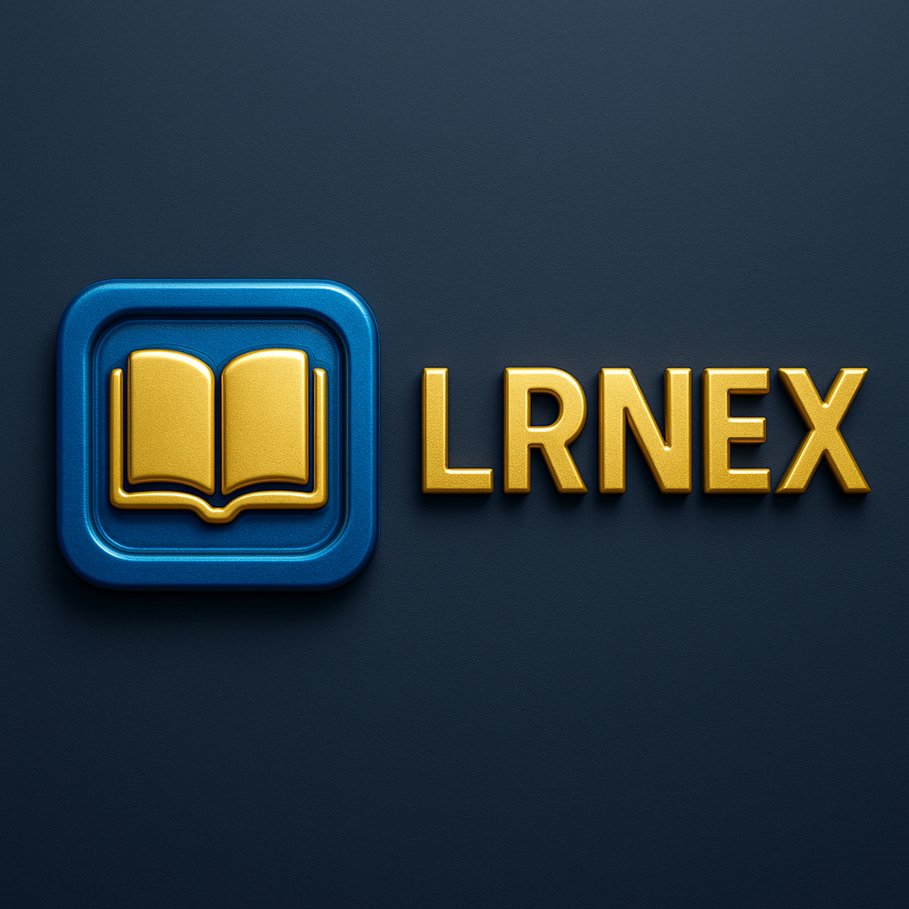

# LRNEX - AI-Powered K-12 Education Platform



A federally compliant, production-ready MVP for K-12 education with AI integration, built with Next.js 14 and modern web technologies.

## 🚀 Features

### For Students
- **Interactive Dashboard** - Progress tracking, assignments, announcements
- **AI Tutor** - Context-aware assistance with streaming responses
- **Assignment Submission** - Text and file uploads with rubric visibility
- **Real-time Messaging** - Secure communication with instructors
- **Voice Input** - Web Speech API integration for AI interactions

### For Instructors
- **Class Management** - Create classes, manage rosters, generate join codes
- **AI-Powered Assignment Creation** - Draft assignments with Qwen 3 assistance
- **Advanced Grading** - Rubric-based grading with inline feedback
- **Analytics Dashboard** - Student progress and at-risk identification
- **Grade Management** - Comprehensive gradebook with export capabilities

### AI Integration
- **Qwen 3 LLM** - Streaming responses with context awareness
- **Safety Guardrails** - Content filtering and appropriate response generation
- **Rate Limiting** - Proper usage controls and token management

### Compliance & Security
- **FERPA/COPPA Compliance** - Parental consent system for <13 users
- **Row-Level Security** - Comprehensive RLS policies in Supabase
- **Audit Logging** - Complete activity tracking and compliance reporting
- **Data Encryption** - TLS in transit, encrypted at rest

## 🛠 Tech Stack

- **Frontend**: Next.js 14 (App Router) + React 18 + TypeScript
- **Styling**: TailwindCSS + Framer Motion + 3D Graphics
- **Backend**: Next.js Route Handlers + Zod Validation
- **Database**: Supabase Postgres + Drizzle ORM
- **Authentication**: NextAuth with Google OAuth
- **AI**: Qwen 3 via DashScope API
- **Storage**: Supabase Storage
- **Deployment**: Vercel + GitHub Actions
- **Testing**: Jest + Playwright + Testing Library

## 🎨 Design System

### Brand Colors (2035 Aesthetic)
- **Background**: `#0B1220` (deep slate)
- **Surface**: `rgba(255,255,255,0.03)` (glass)
- **Primary**: `#2F8CFF` (neon blue)
- **Accent**: `#E2B43C` (gold)
- **Success**: `#16C784`
- **Danger**: `#FF4D4F`

### Features
- **Glassmorphism** - Modern translucent UI elements
- **High Fidelity 3D Graphics** - Advanced visual components
- **Minimalist Futuristic** - Clean, space-age design
- **WCAG 2.1 AA Compliant** - Full accessibility support

## 🚦 Getting Started

### Prerequisites
- Node.js 18+
- Yarn package manager
- Supabase account
- Google OAuth credentials
- Qwen API access

### Installation

1. **Clone and install dependencies:**
   ```bash
   git clone <your-repo>
   cd lrnex
   yarn install
   ```

2. **Set up environment variables:**
   ```bash
   cp .env.example .env.local
   ```
   Fill in your actual credentials in `.env.local`

3. **Set up database:**
   ```bash
   yarn db:migrate
   yarn db:seed
   ```

4. **Run development server:**
   ```bash
   yarn dev
   ```

5. **Open** [http://localhost:3000](http://localhost:3000)

### Environment Variables

```env
# Database
DATABASE_URL=postgresql://your-database-url

# NextAuth
NEXTAUTH_URL=http://localhost:3000
NEXTAUTH_SECRET=your-secret

# Google OAuth
GOOGLE_CLIENT_ID=your-client-id
GOOGLE_CLIENT_SECRET=your-client-secret

# Qwen AI
QWEN_API_KEY=your-qwen-key
```

## 📁 Project Structure

```
/app/                    # Next.js App Router
├── (marketing)/         # Marketing pages
├── (app)/              # Protected application
│   ├── student/        # Student interface
│   └── instructor/     # Instructor interface
└── api/                # API routes

/src/
├── server/             # Backend logic
│   ├── db/            # Database schema & queries
│   ├── auth/          # Authentication
│   ├── llm/           # AI integration
│   └── services/      # Business logic
├── ui/                # UI components
│   ├── components/    # Reusable components
│   └── design-system/ # Design tokens
└── lib/               # Utilities & helpers

/drizzle/              # Database migrations
/tests/                # Test suites
/scripts/              # Utility scripts
/public/               # Static assets
```

## 🧪 Testing

```bash
# Unit tests
yarn test
yarn test:watch

# E2E tests
yarn e2e
yarn e2e:ui

# Type checking
yarn type-check

# Linting
yarn lint
```

## 🚀 Deployment

### Vercel (Recommended)

1. **Connect GitHub repository to Vercel**
2. **Set environment variables in Vercel dashboard**
3. **Deploy automatically on push to main**

### Manual Deploy

```bash
yarn build
yarn start
```

## 📊 Database Schema

### Core Tables
- `users` - User profiles and authentication
- `classes` - Class information and settings
- `enrollments` - Student-class relationships
- `assignments` - Assignment details and rubrics
- `submissions` - Student work submissions
- `grades` - Grading and feedback
- `messages` - Student-instructor communication
- `notifications` - In-app notifications
- `consents` - Parental consent tracking
- `audit_logs` - Compliance and activity logging
- `ai_sessions` - AI conversation tracking
- `ai_messages` - Individual AI interactions

## 🔒 Security Features

- **Row-Level Security (RLS)** - Database-level access control
- **CSRF Protection** - NextAuth CSRF tokens
- **Security Headers** - Comprehensive HTTP security headers
- **Input Validation** - Zod schema validation
- **Rate Limiting** - API and AI endpoint protection
- **Audit Logging** - Complete activity tracking

## 📋 Compliance

### FERPA Compliance
- Educational record protection
- Proper consent management
- Data minimization practices
- Secure data handling

### COPPA Compliance
- Parental consent for <13 users
- Limited data collection
- Secure data storage
- Right to deletion

## 🤝 Contributing

1. Fork the repository
2. Create a feature branch
3. Make your changes
4. Add tests
5. Run linting and tests
6. Submit a pull request

## 📄 License

This project is licensed under the MIT License - see the [LICENSE](LICENSE) file for details.

## 🆘 Support

For support, email support@lrnex.com or join our Discord community.

---

**Built with ❤️ for the future of education**